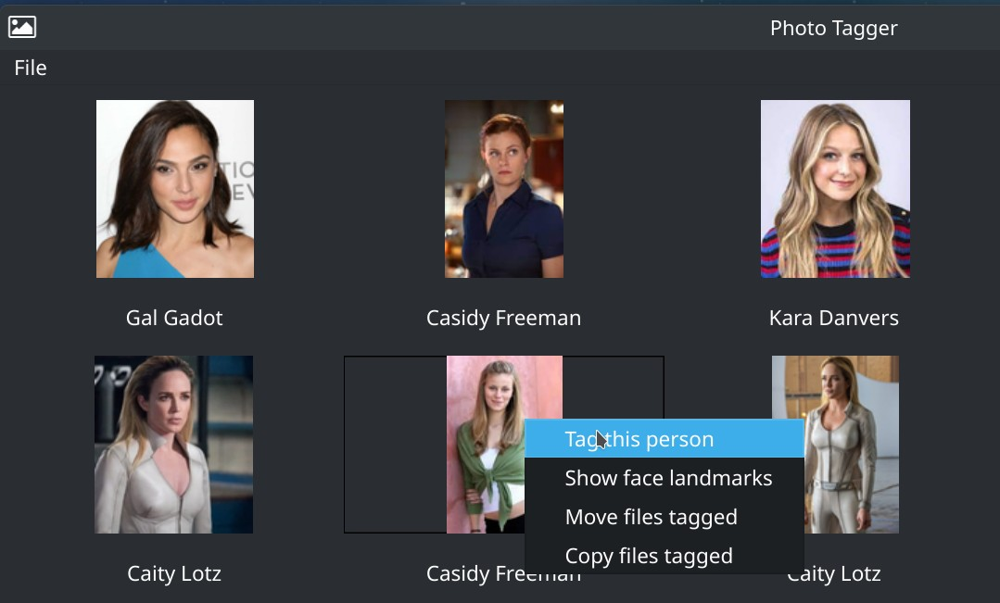
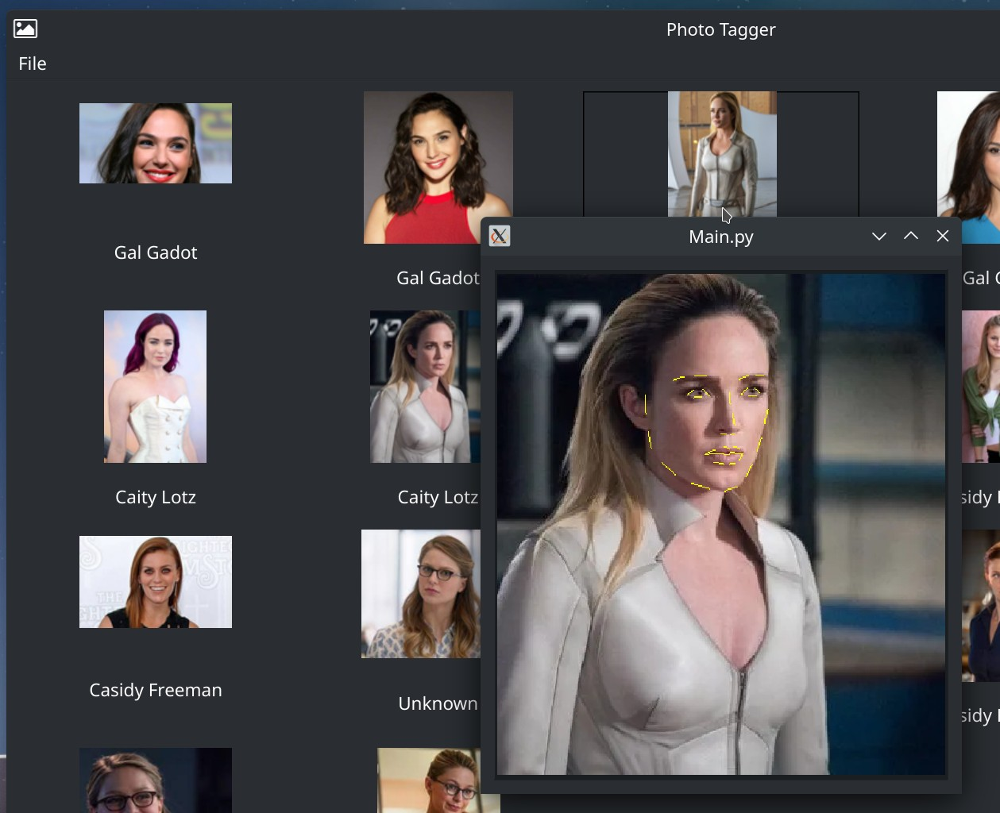

# Photo Tagger

### This project is a GUI implementation for some face recognition AI Python library's:

  - The face recognition engine is based on: [Adam Geitgey library](https://github.com/ageitgey/face_recognition)
  - Adam Geitgey library is based on C++ toolkit machine learning algorithms [dlib](https://github.com/davisking/dlib) 
  - Graphics user interface are built whit [QT PySide6 framework](https://doc.qt.io/qtforpython/) 

### How its works?

Given a folder containing a bunch of people photos, its start collecting the face metadata information and save it to a 
sqlite3 database, later it use de metadata info to compare faces against a selected known person and info will be available to gather all match faces 
by the same tagged name. 

Tagging faces not will modify original file, neither file name. 

## Screenshot 

## Context menu to tag known person

## Face landmarks jus for research purposes

